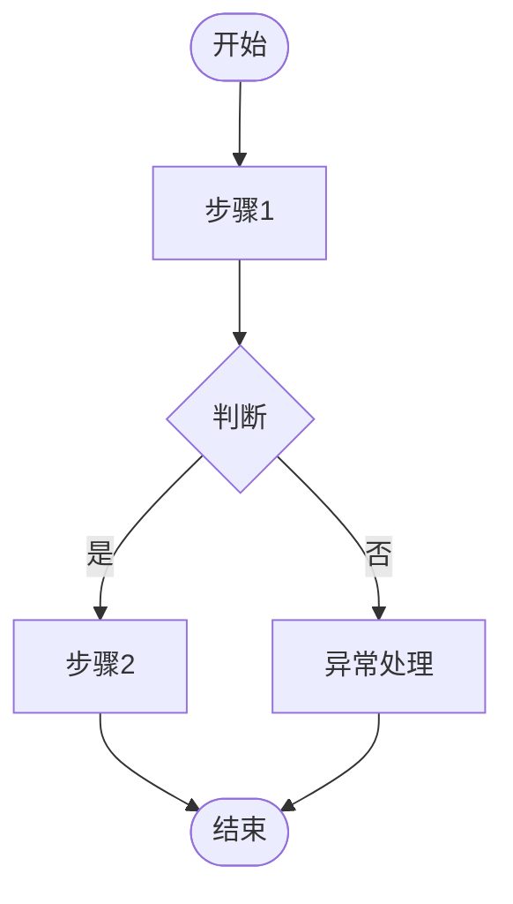

# 产品经理技能集

## 概述

本技能集用于支持产品需求分析工作，涵盖从需求收集到PRD文档输出的完整流程。

### 技能关系图

```
需求收集与分析 → 业务流程图设计 → UI原型设计 → PRD文档编写
     ↑                                                    ↓
     └──────────────── 用户确认 ← 用户评审 ←─────────────┘
```

### 快速选择指南

| 用户输入关键词 | 推荐技能 | 说明 |
|--------------|---------|------|
| "帮我分析一下..."、"需要哪些功能" | 技能1: 需求收集与分析 | 从描述中提取需求，生成功能清单 |
| "流程是什么"、"业务逻辑" | 技能2: 业务流程图设计 | 梳理业务流程，绘制流程图 |
| "界面长什么样"、"原型" | 技能3: UI原型设计 | 设计界面布局和交互 |
| "写需求文档"、"PRD" | 技能4: PRD文档编写 | 编写完整的产品需求文档 |

---

## 技能1: 需求收集与分析

### 技能描述

从用户描述中提取业务需求，分析需求背景，整理成功能清单。

### 触发条件

- 用户提供业务场景描述
- 用户询问"需要哪些功能"
- 用户说"帮我分析一下"

### 具体能力

#### 1.1 需求收集
- 使用Kaiwu Form MCP创建需求收集表单
- 从用户自然语言描述中提取需求点
- 识别需求类型：
  - 功能需求（新增功能、功能优化）
  - 性能需求（响应速度、并发能力）
  - 体验需求（交互优化、视觉优化）
  - 数据需求（报表、统计）

#### 1.2 需求分析
- 分析需求背景和业务价值
- 识别需求优先级（P0/P1/P2/P3）
- 评估需求复杂度（高/中/低）
- 识别需求依赖关系

#### 1.3 功能清单整理
- 使用标准模板整理功能清单
- 为每个功能分配唯一ID
- 定义可测试的验收标准

### 使用工具

| 工具 | 用途 |
|-----|------|
| Kaiwu Form MCP | 创建需求收集表单 |
| WebSearch MCP | 技术调研、竞品分析 |
| SearchCodebase | 分析现有代码能力 |
| Grep/Read | 查找相关代码 |
| Write | 生成功能清单文档 |

### 工作流程

```
1. 创建需求收集表单（Kaiwu Form）
   ↓
2. 收集用户需求（对话/WebSearch）
   ↓
3. 分析需求背景
   ↓
4. 整理功能清单
   ↓
5. 用户确认
```

### 质量检查点

- [ ] 功能清单是否包含所有需求点？
- [ ] 优先级是否合理？
- [ ] 验收标准是否可测试？
- [ ] 依赖关系是否清晰？

### 输出标准

**功能清单.md**

```markdown
# 功能清单

## 项目信息
- 项目名称：
- 创建时间：
- 最后更新：

## 功能列表

### F001 - [功能名称]
- **功能描述**：
- **优先级**：P0/P1/P2/P3
- **复杂度**：高/中/低
- **依赖功能**：Fxxx
- **验收标准**：
  1. 标准1
  2. 标准2
```

### 异常处理

| 异常情况 | 处理方式 |
|---------|---------|
| 需求描述模糊 | 询问用户具体场景和期望结果 |
| 需求冲突 | 列出冲突点，请用户确认优先级 |
| 技术可行性存疑 | 使用WebSearch调研技术方案 |

---

## 技能2: 业务流程图设计

### 技能描述

设计完整的业务流程，包括正常流程、分支流程和异常流程。

### 触发条件

- 用户询问"流程是什么"
- 用户说"帮我梳理一下业务逻辑"
- 已完成需求分析，需要设计流程

### 具体能力

#### 2.1 流程梳理
- 识别主要业务流程
- 识别分支流程（条件判断）
- 识别异常流程（错误处理）
- 识别参与角色和系统

#### 2.2 流程图绘制
- 使用Mermaid语法绘制流程图
- 标注关键节点（决策点、处理点）
- 标注异常处理路径
- 区分不同角色的操作

### 使用工具

| 工具 | 用途 |
|-----|------|
| Write | 生成流程图文档（Mermaid格式） |

### 工作流程

```
1. 分析业务场景
   ↓
2. 识别参与角色
   ↓
3. 梳理主流程
   ↓
4. 设计分支流程
   ↓
5. 设计异常处理
   ↓
6. 绘制流程图
   ↓
7. 用户确认
```

### 质量检查点

- [ ] 是否包含正常流程？
- [ ] 是否包含异常处理？
- [ ] 角色分工是否清晰？
- [ ] 流程是否可以闭环？

### 输出标准

**业务流程图.md**

```markdown
# 业务流程图

## 流程概述
- 流程名称：
- 涉及角色：
- 触发条件：

## 流程图



## 流程说明

### 正常流程
1. 步骤1：...
2. 步骤2：...

### 异常流程
- 异常情况1：处理方式
```

### 异常处理

| 异常情况 | 处理方式 |
|---------|---------|
| 流程过于复杂 | 拆分为多个子流程 |
| 角色不清晰 | 绘制角色-职责矩阵 |

---

## 技能3: UI原型设计

### 技能描述

设计UI原型，展示界面布局、交互元素和页面流转。

### 触发条件

- 用户询问"界面长什么样"
- 用户说"帮我画个原型"
- 已完成流程设计，需要设计界面

### 具体能力

#### 3.1 原型设计
- 设计界面布局（导航、内容区、操作区）
- 标注交互元素（按钮、表单、列表）
- 展示关键页面和页面关系
- 标注交互说明

#### 3.2 原型实现方式
根据场景选择合适的方式：

| 方式 | 适用场景 | 工具 |
|-----|---------|------|
| 浏览器原型 | 快速验证、交互演示 | Chrome DevTools MCP |
| 低代码原型 | 需要可交互的表单 | Kaiwu Form MCP |
| HTML原型 | 高保真、可复用 | Write + 前端技能 |

### 使用工具

| 工具 | 用途 |
|-----|------|
| Chrome DevTools MCP | 浏览器内原型制作 |
| Kaiwu Form MCP | 低代码页面搭建 |
| Write | HTML原型代码 |
| frontend-design skill | 专业UI设计 |

### 工作流程

```
1. 询问用户原型绘制方式
   ↓
2. 根据选择绘制原型
   ↓
3. 截图保存关键页面
   ↓
4. 标注交互说明
   ↓
5. 用户确认
```

### 质量检查点

- [ ] 是否覆盖所有关键页面？
- [ ] 交互逻辑是否清晰？
- [ ] 是否符合用户习惯？
- [ ] 是否考虑了异常状态？

### 输出标准

**UI原型说明.md**

```markdown
# UI原型设计

## 设计说明
- 设计方式：浏览器原型/低代码/HTML
- 适用终端：PC/移动端/响应式
- 设计规范：遵循现有规范/新建规范

## 页面清单

### 页面1 - [页面名称]
- **页面功能**：
- **入口**：
- **主要元素**：
  - 元素1：说明
  - 元素2：说明
- **交互说明**：
- **原型截图**：

## 页面流转图


```

### 异常处理

| 异常情况 | 处理方式 |
|---------|---------|
| 用户不满意设计 | 询问具体修改意见，迭代优化 |
| 技术实现困难 | 与技术沟通，调整设计方案 |

---

## 技能4: PRD文档编写

### 技能描述

编写完整的产品需求文档，清晰描述需求背景、功能逻辑和验收标准。

### 触发条件

- 用户说"写个PRD"
- 用户说"写需求文档"
- 已完成原型设计，需要输出文档

### 具体能力

#### 4.1 文档结构设计
- 使用标准PRD模板
- 包含所有必要章节
- 结构清晰、易于阅读

#### 4.2 内容编写
- 从用户视角描述功能
- 不包含技术实现细节
- 描述清晰、无歧义
- 配合原型图说明

### 使用工具

| 工具 | 用途 |
|-----|------|
| Read | 读取PRD模板 |
| Write | 生成PRD文档 |

### 工作流程

```
1. 读取PRD模板
   ↓
2. 填充需求背景
   ↓
3. 编写功能概述（含业务流程）
   ↓
4. 编写详细功能描述（含原型图）
   ↓
5. 编写测试要点
   ↓
6. 用户评审
```

### 质量检查点

- [ ] 需求背景是否清晰？
- [ ] 功能描述是否完整？
- [ ] 验收标准是否可测试？
- [ ] 是否包含异常场景？
- [ ] 文档结构是否清晰？

### 输出标准

**PRD文档.md**

```markdown
# PRD - [项目名称]

## 1. 需求背景
- 业务背景：
- 用户痛点：
- 预期目标：

## 2. 功能概述
- 功能范围：
- 业务流程：
- 涉及角色：

## 3. 详细功能描述

### 3.1 [功能模块1]
#### 3.1.1 [功能点1]
- **功能描述**：
- **前置条件**：
- **操作步骤**：
- **预期结果**：
- **原型图**：
- **异常处理**：

## 4. 非功能需求
- 性能要求：
- 安全要求：
- 兼容性要求：

## 5. 测试要点
- 测试场景1：
- 测试场景2：

## 6. 附录
- 术语表：
- 参考文档：
```

### 异常处理

| 异常情况 | 处理方式 |
|---------|---------|
| 文档过于冗长 | 拆分核心功能和扩展功能 |
| 需求变更频繁 | 使用版本管理，记录变更历史 |

---

## 附录

### A. 常用模板路径

- PRD模板：`/Users/apple/Desktop/文件/kaiwu_didaV1.0/kaiwu_dida/templete/PRD_document.md`
- 功能清单模板：见技能1输出标准
- 流程图模板：见技能2输出标准

### B. 变更日志

| 版本 | 日期 | 变更内容 | 作者 |
|-----|------|---------|------|
| 1.0 | - | 初始版本 | - |
| 2.0 | 2026-03-17 | 优化结构，添加质量检查点和异常处理 | AI |

### C. 使用示例

**示例场景**：用户说"帮我设计一个学生选课系统"

1. **技能1**：分析需求，生成功能清单
   - 学生选课、退课
   - 教师发布课程
   - 管理员审核

2. **技能2**：设计业务流程
   - 选课流程
   - 退课流程
   - 审核流程

3. **技能3**：设计UI原型
   - 学生端选课页面
   - 教师端课程管理页面
   - 管理端审核页面

4. **技能4**：编写PRD文档
   - 整合以上所有内容
   - 输出完整需求文档
