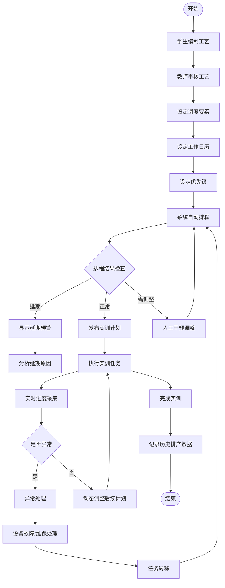
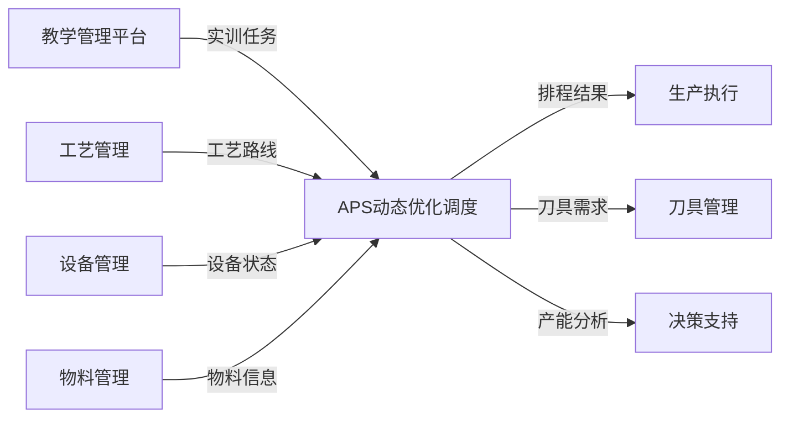

# APS动态优化调度需求分析文档

## 文档信息

| 项目 | 内容 |
|------|------|
| 文档名称 | APS动态优化调度需求分析 |
| 所属系统 | 智慧工厂管控平台 |
| 模块名称 | 动态优化调度（APS） |
| 文档版本 | V1.0 |
| 编制日期 | 2026-02-05 |
| 来源文档 | 技术要求-全表.xlsx |

---

## 1. 应用场景描述

### 1.1 核心场景

APS（Advanced Planning and Scheduling，高级计划与排程）模块主要服务于**教学实训场景**，连接学生工艺编制与车间实训任务安排。

### 1.2 场景详情

| 场景维度 | 详细说明 |
|---------|---------|
| **核心用户** | 教师（计划安排者）、学生（实训参与者） |
| **业务流程** | 学生通过自行编制的工艺 → 老师结合学校实验设备进行计划安排 → 安排车间现场具体实训任务 |
| **教学目标** | 让学生了解企业计划安排的关键因素，模拟车间生产的计划调度过程 |
| **实际用途** | 合理安排学生在工训车间的任务，避免工训条件与工训任务不匹配的情况 |
| **决策支持** | 通过系统模拟功能，清晰了解工训设备产能是否满足在校学生的工训任务，为车间工训任务安排或设备采购提供建议 |

### 1.3 应用价值

- **教学价值**：帮助学生理解企业APS系统的运作原理
- **实用价值**：优化实训资源分配，提高设备利用率
- **决策价值**：为设备采购和课程安排提供数据支撑

---

## 2. 功能概述

### 2.1 功能定位

APS模块是智慧工厂管控平台的核心调度引擎，负责将教学任务转化为可执行的车间实训计划。

### 2.2 功能类型

- [x] 新增功能模块
- [ ] 功能变更迭代

### 2.3 系统架构

| 架构要求 | 说明 |
|---------|------|
| **部署方式** | B/S架构模式，服务器部署 |
| **客户端** | 浏览器访问，充分利用服务器性能 |
| **操作方式** | 客户端通过浏览器进行排产、查看排程结果 |

---

## 3. 业务流程图

---

## 4. 核心功能需求

### 4.1 调度要素设定

| 调度要素 | 功能说明 | 业务规则 |
|---------|---------|---------|
| **设备效率设定** | 根据设备新旧效能设定不同效率值 | 新设备效率100%，旧设备按实际情况折减 |
| **零件转运时间设定** | 设定工序间物料转运所需时间 | 根据车间布局设定不同区域间转运时间 |
| **设备保养及维修周期设定** | 设定设备维保周期 | 维保期间不安排生产任务 |
| **物料到达时间设定** | 设定实验物料的计划到厂时间 | 物料未到时不启动相关工序排程 |
| **多层级优先级设定** | 支持项目/产品/零件/工序多层级优先级 | 至少支持30级以上优先级区分 |

### 4.2 自动排程功能

| 功能编号 | 功能名称 | 功能描述 | 技术要求 |
|---------|---------|---------|---------|
| APS-001 | 定时自动排程 | 系统自动执行排程运算 | 每日一次或多次，频次最高0.5小时/次，无需手工操作 |
| APS-002 | 工作日历设定 | 设定正常工作时间及加工工作时间 | 支持正常上课时间、非正常上课时间分别设定 |
| APS-003 | 智能分析 | 自动识别放假时间段 | 放假时间段内不予排程 |
| APS-004 | 产能负载计算 | 根据在制实验零件信息自动计算 | 预测瓶颈资源，提供产能分析 |
| APS-005 | 任务均衡 | 自动均衡同类实训设备计划任务 | 避免设备忙闲不均 |
| APS-006 | 投产日期设定 | 支持实验零件的投产日期设定 | 优先安排正常上课时间，不满足节点时才安排非正常时间 |
| APS-007 | 动态调整 | 根据前道任务进度自动调整 | 自动根据前道实验任务的实际进度调整后道实验任务的排产计划 |
| APS-008 | 成套优先 | 同一实验订单优先成套 | 同一实验订单下的零件会集中在某一区间内完成 |

### 4.3 可视化排程界面

| 功能编号 | 功能名称 | 功能描述 | 展示内容 |
|---------|---------|---------|---------|
| APS-009 | 可视化排程界面 | 提供直观的排程结果展示 | 甘特图、设备负载图、工序时间轴 |
| APS-010 | 延期预警 | 直观反馈延期零件的延期工序 | 红色高亮显示延期任务，标注延期原因 |
| APS-011 | 紧迫程度提示 | 显示工序的紧迫程度 | 显示最迟开工时间、剩余缓冲时间 |
| APS-012 | 历史记录查询 | 记录历史排产数据 | 支持下载历史排产计划 |
| APS-013 | 操作履历 | 记录排产操作日志 | 记录操作人、时间、成功与否、是否有异常 |

### 4.4 异常处理与重排程

| 功能编号 | 功能名称 | 功能描述 | 处理逻辑 |
|---------|---------|---------|---------|
| APS-014 | 生产插单 | 支持紧急插单 | 系统自动重新排程，评估对现有计划的影响 |
| APS-015 | 急加件处理 | 支持紧急加件 | 优先安排紧急零件，调整其他任务 |
| APS-016 | 返工处理 | 支持返工任务的排程 | 重新安排返工工序，关联原工序记录 |
| APS-017 | 暂停/停止 | 支持任务暂停和停止 | 记录暂停原因，释放设备资源 |
| APS-018 | 设备故障处理 | 设备故障/维保时的任务转移 | 设定设备状态后，自动将原定任务安排到其他设备 |

### 4.5 工作日历维护

支持维护及变更以下时间类型：

| 时间类型 | 说明 |
|---------|------|
| 正常上课时间 | 标准教学时间 |
| 错峰停电 | 特殊停电安排 |
| 上半天班 | 半日工作模式 |
| 法定节假日 | 系统自动识别节假日 |

---

## 5. 业务规则

### 5.1 排程规则

| 规则编号 | 规则名称 | 规则内容 |
|---------|---------|---------|
| BR-001 | 优先级规则 | 支持多级优先级设置，至少30级以上 |
| BR-002 | 时间规则 | 优先安排正常上课时间，紧急情况下才安排非正常时间 |
| BR-003 | 设备约束 | 排程必须考虑设备效率，新旧设备效能不同 |
| BR-004 | 成套规则 | 同一订单零件优先成套完成 |
| BR-005 | 动态调整规则 | 根据实际进度自动调整后续计划 |
| BR-006 | 放假规则 | 放假时间段内不予排程 |
| BR-007 | 维保规则 | 设备维保期间不安排任务 |
| BR-008 | 物料规则 | 物料未到达不启动相关工序 |

### 5.2 约束条件

| 约束类型 | 约束内容 |
|---------|---------|
| **工艺约束** | 工序间加工顺序和约束关系 |
| **设备约束** | 设备能力、效率、状态 |
| **时间约束** | 工作日历、交期要求 |
| **物料约束** | 物料到达时间 |
| **人力约束** | 操作人员技能、数量 |

---

## 6. 数据需求

### 6.1 输入数据

| 数据类别 | 数据内容 | 数据来源 |
|---------|---------|---------|
| **工艺数据** | 工序路线、工时、设备要求 | 工艺管理模块 |
| **设备数据** | 设备清单、效率、状态、维保计划 | 设备管理模块 |
| **订单数据** | 实训任务、优先级、交期 | 教学管理平台 |
| **物料数据** | 物料清单、计划到厂时间 | 物料管理模块 |
| **日历数据** | 工作日历、节假日 | 系统配置 |

### 6.2 输出数据

| 数据类别 | 数据内容 | 数据用途 |
|---------|---------|---------|
| **排程结果** | 工序计划、设备分配、时间安排 | 指导生产执行 |
| **延期预警** | 延期任务清单、原因分析 | 异常处理 |
| **产能分析** | 设备负载、瓶颈分析 | 决策支持 |
| **历史记录** | 排产数据、操作履历 | 追溯分析 |

---

## 7. 与其他模块的关联

### 7.1 模块关系图

### 7.2 接口说明

| 关联模块 | 数据流向 | 关联内容 |
|---------|---------|---------|
| **教学管理平台** | 接收 | 接收实训任务订单（项目/产品/零件/工序层级） |
| **工艺管理** | 接收 | 获取学生编制的工艺路线、工序工时、设备要求 |
| **设备管理** | 接收 | 获取设备效率、状态、维保周期等信息 |
| **物料管理** | 接收 | 获取物料计划到厂时间 |
| **刀具管理** | 输出 | 提供备刀刀具需求计划明细（刀具明细、需求时间、工序） |
| **生产执行** | 输出 | 输出工序级排程计划，指导现场执行 |

---

## 8. 非功能性需求

### 8.1 性能要求

| 指标 | 要求 |
|------|------|
| 排程运算时间 | ≤ 5分钟（100个零件以内） |
| 系统响应时间 | ≤ 3秒 |
| 并发用户数 | ≥ 50人 |

### 8.2 可靠性要求

| 指标 | 要求 |
|------|------|
| 系统可用性 | ≥ 99.5% |
| 数据备份 | 每日自动备份 |
| 故障恢复 | ≤ 30分钟 |

### 8.3 易用性要求

| 指标 | 要求 |
|------|------|
| 操作界面 | 可视化、直观 |
| 学习成本 | 新用户1小时内可上手 |
| 帮助文档 | 提供在线帮助和操作指南 |

---

## 9. 验收标准

### 9.1 功能验收

| 验收项 | 验收标准 |
|-------|---------|
| 自动排程 | 能够按照设定规则自动生成排程计划 |
| 可视化界面 | 提供甘特图等可视化展示 |
| 延期预警 | 准确识别并显示延期任务 |
| 异常处理 | 支持插单、急件、返工等异常场景 |
| 历史记录 | 完整记录排产历史和操作履历 |

### 9.2 性能验收

| 验收项 | 验收标准 |
|-------|---------|
| 排程速度 | 100个零件排程时间 ≤ 5分钟 |
| 系统稳定性 | 连续运行7天无故障 |
| 数据准确性 | 排程结果与实际执行偏差 ≤ 5% |

---

## 10. 附录

### 10.1 术语表

| 术语 | 英文 | 说明 |
|------|------|------|
| APS | Advanced Planning and Scheduling | 高级计划与排程 |
| 排程 | Scheduling | 将任务分配到具体设备和时间段 |
| 工序 | Operation | 零件加工的一个步骤 |
| 瓶颈资源 | Bottleneck Resource | 限制产能的关键设备或工序 |
| 稼动率 | Utilization Rate | 设备实际运行时间/计划运行时间 |

### 10.2 参考文档

- 技术要求-全表.xlsx
- 智慧工厂管控平台PRD文档
- 教学管理平台PRD文档

---

**文档结束**
